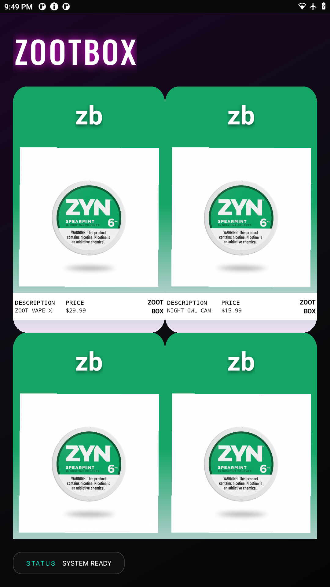

# ZootBox Vending Machine App

Android vending machine application with modern gradient UI, product details, and age verification system.

## Features

- **Product Grid**: 2-column grid layout with animated product cards
- **Gradient Backgrounds**: Dynamic gradient matching between product cards and detail pages
- **Product Details**: Comprehensive product information with rounded container design
- **Age Verification**: ID scanning integration for age-restricted products
- **Modern UI**: Material Design with glass morphism effects and elevation
- **Video Support**: Product videos for enhanced shopping experience

## Screenshots



## Technical Stack

- **Language**: Kotlin
- **Min SDK**: Android 11 (API 30)
- **Target SDK**: Android 14 (API 34)
- **Architecture**: MVVM pattern
- **UI Framework**: Material Design Components
- **Build System**: Gradle with Kotlin DSL

## Key Components

### MainActivity
- Product grid display with GridLayoutManager
- Custom ProductAdapter with gradient backgrounds
- Smooth animations and transitions

### ProductDetailActivity
- Dynamic gradient background matching
- Rounded elevated containers
- Age verification integration
- Quantity selection and cart functionality

### IdScanActivity
- Age verification workflow
- Animated scanning interface
- Multi-state UI (Idle, Scanning, Success)

## Gradient System

The app features a sophisticated gradient matching system:
- Product cards have gradients defined in drawable resources
- `bg_card_gradient.xml`: Default green-to-pink gradient
- `bg_zyn_citrus_gradient.xml`: Special yellow-to-pink gradient
- Gradients dynamically scale to full-screen on detail pages

## UI Design

- **Rounded Corners**: 24dp for main containers, 12dp for secondary
- **Elevation Depths**: 8dp (images), 4dp (primary cards), 2dp (secondary cards)
- **Spacing**: 12dp between grouped containers, 80dp bottom padding
- **Color Scheme**: Neon green (#14A566), pink (#F0E0F5), deep blacks

## Building the Project

### Prerequisites
- Android Studio (latest version)
- JDK 17+
- Android SDK with API 34

### Build Commands

**Debug APK:**
```bash
./gradlew assembleDebug
```

**Install to Device:**
```bash
./gradlew installDebug
```

**Or use ADB directly:**
```bash
adb install -r app/build/outputs/apk/debug/app-debug.apk
```

## Project Structure

```
app/
├── src/main/
│   ├── java/com/example/myapplication/
│   │   ├── MainActivity.kt
│   │   ├── ProductAdapter.kt
│   │   ├── ProductDetailActivity.kt
│   │   ├── IdScanActivity.kt
│   │   └── hardware/
│   │       ├── HardwareService.kt
│   │       ├── IdScannerManager.kt
│   │       └── NayaxPaymentManager.kt
│   └── res/
│       ├── layout/
│       │   ├── activity_main.xml
│       │   ├── activity_product_detail.xml
│       │   ├── activity_id_scan.xml
│       │   └── item_product_card.xml
│       ├── drawable/
│       │   ├── bg_card_gradient.xml
│       │   ├── bg_zyn_citrus_gradient.xml
│       │   └── ...
│       └── font/
│           ├── y2k_brutalism.otf
│           ├── archivo_black.ttf
│           └── ...
```

## Hardware Integration

The app includes stubs for hardware integration:
- **HardwareService**: Motor control for product dispensing
- **IdScannerManager**: ID verification system
- **NayaxPaymentManager**: Payment processing

## Development Notes

- Uses ConstraintLayout for flexible, responsive layouts
- Implements programmatic gradient creation for dynamic scaling
- CardView with custom elevation for depth perception
- NestedScrollView for smooth scrolling on detail pages

## Future Enhancements

- Backend API integration
- User accounts and order history
- Real-time inventory management
- Payment gateway integration
- Analytics and reporting

## License

Proprietary - All rights reserved

## Contact

Developer: bossmandlow523
Email: 208856734+bossmandlow523@users.noreply.github.com
